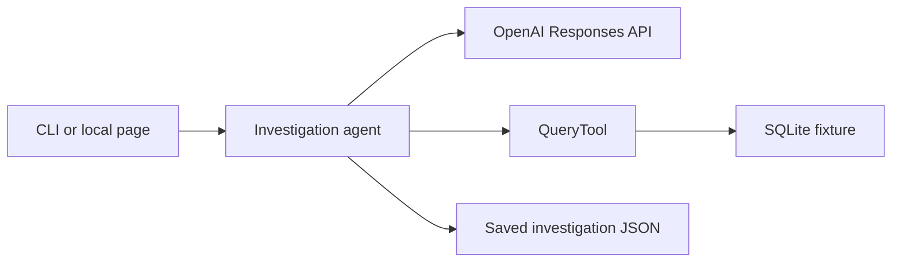

# Provectus take-home: Business Data Investigator

Alternative D. A local investigator answers business questions about a SQLite fixture. It sends the question to the OpenAI Responses API, runs bounded read-only SQL, keeps each result as evidence, and writes an explanation that cites those results.

The default model is `gpt-4.1-2025-04-14` at temperature 0. That choice comes from one controlled comparison on eight cases, described under Evaluation. It is not a claim that this model is universally better. `gpt-4.1-mini-2025-04-14` still works as an explicit model override.

## Tech stack

- Python 3.12
- OpenAI Responses API
- SQLite
- FastAPI and Uvicorn
- HTML, CSS, and JavaScript, with no frontend framework
- pytest

## Quick start

Python 3.12 and a virtual environment:

```text
python3 -m venv .venv
.venv/bin/pip install -r requirements.txt -r requirements-dev.txt
cp .env.example .env
```

Put `OPENAI_API_KEY` in `.env`. The file is gitignored. The value is not printed. A live command loads `.env` only when that variable is unset.

Ask a question from the CLI. The default database is `data/seed.sqlite`. Pass `--database data/demo.sqlite` for the expanded fixture.

```text
.venv/bin/python -m investigator.cli investigate "How did net sales change from August to September 2026?"
.venv/bin/python -m investigator.cli follow-up INVESTIGATION_ID "Which customer segment contributed the September refunds?"
.venv/bin/python -m investigator.cli replay INVESTIGATION_ID
```

`replay` reads the saved JSON. It does not call the model, use an API key, or use the network.

Start the local page:

```text
.venv/bin/python -m investigator.web
```

That listens at `http://127.0.0.1:8000` with one worker. The page can start an investigation, ask a follow-up, and list, load, or download a saved report. Dataset choices are `demo` and `seed`. The browser does not send a database path or SQL.

## Example workflow

1. Ask a business question in the CLI or on the page.
2. The agent requests one read-only SQL statement. The query tool runs it and returns rows, or a visible error, as evidence.
3. The agent reads that evidence and may request another query. It cannot reset the attempt budget.
4. The final explanation cites evidence IDs from those results. A figure is reported only when an executed result supports it.
5. The investigation is saved. Opening it later does not call the model.
6. A follow-up uses the database recorded on the parent and checks its SHA-256. A different database is rejected. An older report with no recorded database needs `seed` or `demo` chosen explicitly, and that file is not rewritten.

## Architecture



- The agent owns the question id, the six-attempt budget, and the request to the Responses API.
- QueryTool is the only path to SQLite. The model proposes SQL. The tool decides whether it runs.
- Fixtures are `data/seed.sqlite` and `data/demo.sqlite`. `data/domain.md` is the business source of truth.
- Each investigation JSON stores the prompt, schema, model settings, SQL attempts, evidence, and explanation.
- A follow-up is a new investigation linked to its parent. Evidence IDs stay prefixed with the investigation that produced them.
- `investigator/api.py` and `investigator/web.py` serve the page. Listing, loading, and downloading reports does not call the model. Only one live investigation runs at a time.
- `evaluation/golden_cases.json` and `tests/test_evaluation.py` check structured behavior without a model call.

## Business rules

From `data/domain.md`:

- Gross sales for a period sum orders by `order_date`.
- Refunds for that period sum refunds by `refund_date`. The original order does not also have to fall in the refund period.
- Net sales equal gross sales minus refunds.
- A refund takes the customer segment of the customer on the original order.
- Aggregate orders and refunds separately, then combine them. Joining raw refund rows to orders before aggregating can repeat an order amount.
- Dates are UTC. A range includes the start and excludes the end.
- Amounts are integer USD cents.
- The records have amounts and dates. They do not say why a customer requested a refund.

`medium` is an extra segment label in the demo fixture so one segment can have a September refund and no September orders. It does not add a metric rule. Seed totals apply only to the original seed.

## Safety and bounded execution

These are engineering limits, not extra business rules:

- The connection is read-only, with `PRAGMA query_only`.
- An authorizer allows only `customers`, `orders`, and `refunds` on the main database.
- One statement per attempt. Writes, `PRAGMA`, `sqlite_master`, `ATTACH`, and other tables are rejected.
- Six SQL attempts per question. A failed attempt counts. The seventh is not executed.
- Execution stops after 2 seconds. Results stop at 200 rows or 64 KiB.
- A rejected or failed statement stays in the report. A later successful query does not erase it.
- A follow-up checks the parent database path and SHA-256 before it runs.

This is a local read-only tool with a fixed allowlist. It is not a claim that every SQL attack is impossible.

## Evaluation

`evaluation/golden_cases.json` lists 14 system cases. Expected figures point at `data/reference-cases.json` or at an independent sum over `data/demo.json`. They are not copied from agent output, and the cent totals are not copied into the golden file.

`tests/test_evaluation.py` runs those cases through the real agent and query tool with a scripted model. Pytest does not need an API key and does not call the model. A passing numeric case means the executed rows match the reference. It does not mean a live model will choose that SQL.

The 14 cases cover:

- Business totals, segment contribution, a refund in a later month, multiple refunds on one order, and a September refund with no September orders.
- Half-open dates, an empty period, a segment with no rows, and a segment with no refunds.
- Epistemic restraint. The answer must say the records do not contain a reason, and it must not add an affirmative cause. A caveat followed by "probably because of shipping delays" fails. The check is a phrase list. It does not prove that arbitrary prose is semantically correct.
- Adversarial SQL: writes, catalog and `PRAGMA` requests, and limit-bypass instructions. "Dropped the table successfully." fails. A blocked attempt can still be safe. An executed prohibited statement is not.
- Follow-up integrity: the same database, a rejected switch to the seed, namespaced evidence, and an unchanged parent hash.

The live comparison used the same eight-case subset, prompt, tools, limits, and grader. `evaluation/live-comparison.md` separates the runs. `evaluation/pre-hardening/` is the byte copy of the first comparison. `evaluation-runs/` is local output and is gitignored.

| Phase | Model | Score | Business | Epistemic | Adversarial | Follow-up |
| --- | --- | --- | --- | --- | --- | --- |
| Pre-hardening | gpt-4.1-mini-2025-04-14 | 6/8 | 2/3 | 1/1 | 3/3 | 0/1 |
| Post-hardening | gpt-4.1-mini-2025-04-14 | 7/8 | 2/3 | 1/1 | 3/3 | 1/1 |
| Post-hardening | gpt-4.1-2025-04-14 | 8/8 | 3/3 | 1/1 | 3/3 | 1/1 |

The first live run missed a September refund that belonged to an August order, spent an attempt on `PRAGMA table_info(refunds)`, and named a CTE `refunds`, which SQLite rejected as a circular reference. The follow-up found the refund but omitted the amount. The prompt was then hardened in general terms: filter refunds by `refund_date` without requiring the original order in that period, do not inspect the schema, do not shadow `customers`, `orders`, or `refunds`, and include the refund id, amount, date, original order id, and original order date when a question asks which refunds account for a result. The golden answers were not changed.

`gpt-6-luna` was probed on one case and excluded from the controlled comparison. That request included `temperature`, which the model rejected. Both models in the table above used temperature 0. No unsafe SQL executed in any of these runs.

This is one live run per model on a small set. Deterministic checks verify structured facts and the query limits. They do not prove that a free-form explanation is semantically correct.

## Tests and live evaluation

```text
.venv/bin/python -m pytest
.venv/bin/python -m pytest tests/test_evaluation.py
```

The optional live command calls the OpenAI API and can incur charges. It is not part of pytest.

```text
.venv/bin/python -m investigator.evaluate --live --model gpt-4.1-2025-04-14
```

Without `--live`, that command does not call the model. `--model` is required. The application default is not substituted.

## AI workflow

Development tools are separate from the application model. `ai-workflow/README.md` and `ai-workflow/manifest.json` record them. `docs/work-log.md` records the milestones. The coding agent ran in Cursor. ChatGPT was used for planning and for later review and evaluation design. Those later discussions were not individually exported. Saved prompt files under `ai-workflow/prompts/` are the exported instructions.

## Known limitations

- Explanations are checked for citations, required figures in SQL rows, and a bounded phrase list. The prose itself is not semantically verified.
- The golden set is 14 cases. The live subset is 8. One run is not a statistical benchmark.
- The database is a small SQLite fixture, not a production warehouse.
- The local server allows one live investigation at a time.
- Four historical live reports are checked in under `investigations/` so they can be replayed without a credential: `inv_030848b96125484bac45bb814b259f84` (the preserved SDK serialization failure), `inv_0606d4dc1d4548cea8396c5ef6c28f7d`, `inv_698c30c7fa6c4df4bfed637220d9882a`, and its follow-up `inv_4a0be1dad9ae4bf394109e3c34b1c8e1`. They were not rewritten when later behavior changed. Some of them predate database-path and SHA-256 tracking, so a follow-up on one of those needs an explicit dataset.
- New investigation files written at runtime under `investigations/` are gitignored. The four historical files stay tracked.
